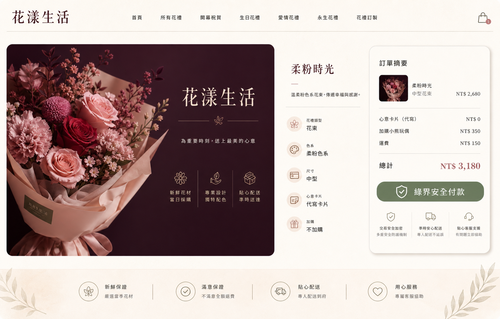

# 花漾生活設計稿與切版佐證

## 設計工具與產出方式

- 設計工具：OpenAI Image Generation（由 Codex 的 imagegen 工具呼叫）
- 設計產出：`flower-life-design-concept.png`
- 商品視覺素材：`public/images/flower-life-bouquet.png`
- 產出時間：2026-07-26
- 設計用途：作為商品頁、購物袋、結帳、訂單確認與付款完成頁的視覺基底。

## 視覺方向

設計以「精品花禮店」為核心：奶油白背景、酒紅色主視覺、玫瑰粉點綴、橄欖綠作為安全付款狀態色。畫面使用較寬鬆的留白、低對比陰影與圓角卡片，使付款資訊清晰但不顯得冰冷。

## 設計稿到實作對照

| 設計元素 | 前端實作 |
| --- | --- |
| 酒紅花禮主視覺 | 商品頁 Hero 與商品圖片容器 |
| 奶油白畫布與紙感卡片 | 全站背景、結帳與訂單資訊卡 |
| 橄欖綠安全付款識別 | 綠界付款 CTA 與成功狀態 |
| 分段訂單摘要 | 結帳、訂單確認、付款完成頁 |

## 已完成的切版截圖

| 畫面 | 螢幕尺寸 | 截圖 |
| --- | --- | --- |
| 商品詳情 | 桌面 | [implementation-product-desktop.jpg](./implementation-product-desktop.jpg) |
| 結帳填寫 | 桌面 | [implementation-checkout-desktop.jpg](./implementation-checkout-desktop.jpg) |
| 付款完成 | 桌面 | [implementation-payment-success-desktop.jpg](./implementation-payment-success-desktop.jpg) |
| 商品詳情 | 手機 | [implementation-product-mobile.jpg](./implementation-product-mobile.jpg) |

這四張截圖由 `npm run design:capture` 以本機 Chrome 重新產生，作為「設計稿 → 響應式切版」的可查驗紀錄。
